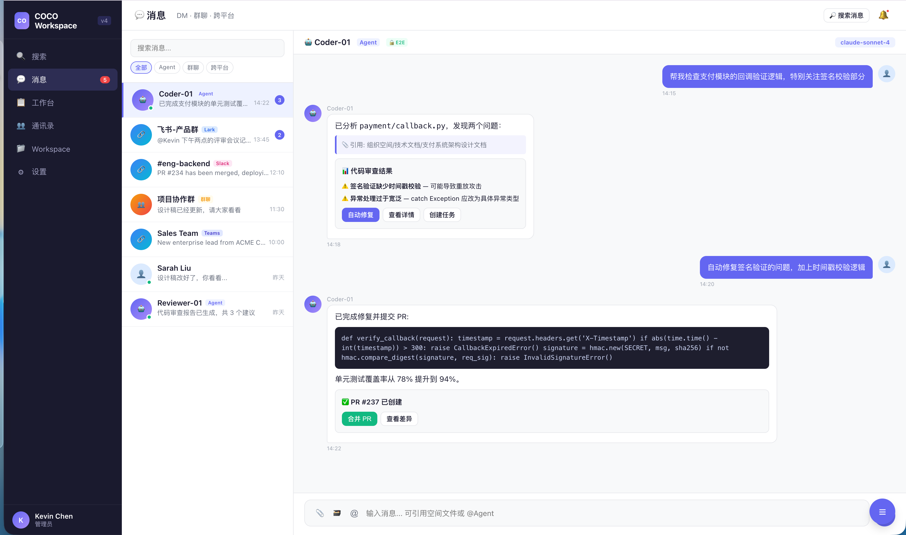
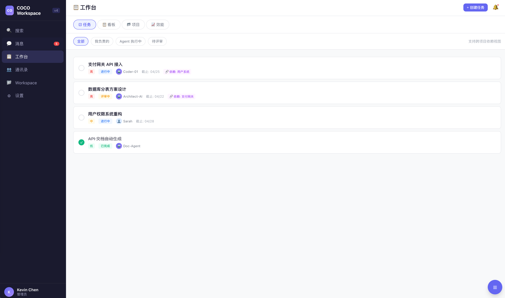
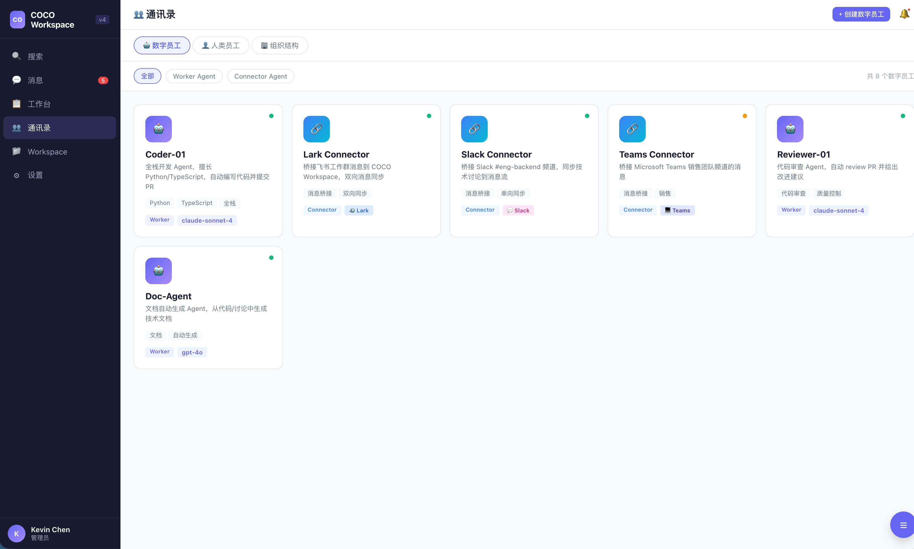
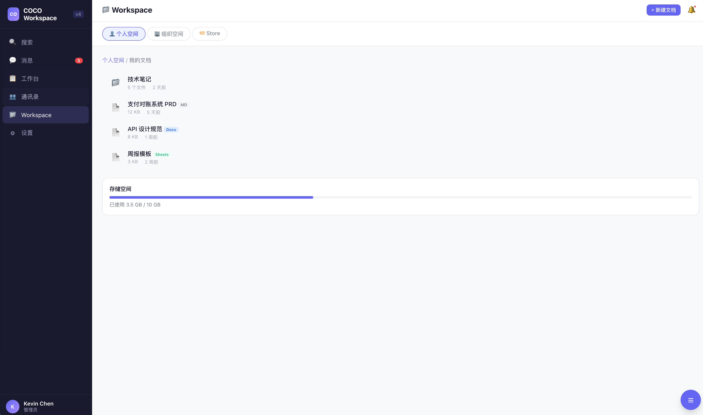

# COCO AI — Product Vision & Strategy Roadmap

> 2026-04-22 | Kevin 主讲 | AWS Hong Kong (Tower 535, Causeway Bay)
> 主题：COCO 的产品愿景与战略规划
> 时段：18:45 - 19:00（15 分钟 Keynote）
> 受众：潜在客户、AI 产品创始人、开发者、投资人、生态合作方

---

## 叙事主线

**从"AI 助手"到"AI 团队" — COCO 如何让每个企业都能部署自己的 Agent 团队**

---

## 一、开场：一个判断（2 分钟）

> "软件行业正在经历第三次范式转移。"

| 范式 | 时代 | 用户体验 |
|------|------|----------|
| **On-Premise** | 2000s | 买软件，装在自己电脑上 |
| **SaaS** | 2010s | 订阅服务，浏览器打开就用 |
| **SaaA** | 2025+ | **Agent 就是软件 — 你描述目标，Agent 端到端完成** |

> "SaaS 时代，你需要学会用软件。SaaA 时代，你只需要告诉 Agent 你要什么。
>
> COCO 做的事情，就是让这个转变真正落地 — 不是概念，不是 demo，是能部署、能管理、能规模化的 Agent 团队。"

**破冰数字**（建立可信度）：

> "我自己的团队，7 个 AI Agent 持续工作。上个月提交了 1500+ PR。这不是实验，是我们每天的生产系统。"

---

## 二、用户需求的变化（1 分钟）

> "用户对 Agent 的期望在逐步升级。"

| 阶段 | 用户诉求 | 典型问题 |
|------|---------|---------|
| **用上 Agent** | 先跑起来一个能干活的 | "我想让 AI 帮我写内容 / 做客服" |
| **Agent 协同** | 多个 Agent + 人一起干 | "能不能让 Agent 之间互相配合？" |
| **Agent 效能** | 要看到产出和 ROI | "花了多少钱，省了多少人？" |
| **一步到位** | 开箱即用，不想自己搭 | "有没有现成的行业方案？" |

---

## 三、产品愿景：四层架构（3 分钟）

### 全景图（一页 slide）

```
┌────────────────────────────────────────────────┐
│  L4  AgentMarket（预制菜）                       │
│      预制 Agent + Skill 市场 — 降低使用门槛        │
├────────────────────────────────────────────────┤
│  L3  Workspace（餐厅）            ← 今天重点      │
│      Dashboard + APP — 用户直接使用的产品          │
├────────────────────────────────────────────────┤
│  L2  AgentOS（灶）                              │
│      运行时底座 — 资源编排 + 沙盒 + 记忆 + 通信     │
├────────────────────────────────────────────────┤
│  L1  LLM + Cloud（燃料）                        │
│      多模型路由 + AWS 云基础设施                    │
└────────────────────────────────────────────────┘
```

### 每层一句话讲清楚

**L1 — LLM + Cloud（燃料）**
> "我们不绑定任何一家模型。Claude、GPT、Gemini、国产模型 — 按场景选最优。"

**L2 — AgentOS（灶）— 核心壁垒**
> "Agent 要真正能工作，需要四样东西：持久记忆、多通道通信、任务调度、安全沙箱。这一层是开源的 — Zylos。"

**L3 — Workspace（餐厅）— 用户产品**
> "这是用户直接使用的产品。下面重点展开。"

**L4 — AgentMarket（预制菜）— 生态**
> "不是所有人都想从零开始。AgentMarket 提供开箱即用的行业 Agent — 客服、运营、分析、内容创作。一键部署，5 分钟完成第一个任务。"

---

## 四、Workspace 重点展开（5 分钟）

### 定位

> "一句话：**Workspace 是 HxA（Human × Agent）时代的 Slack。**
>
> Slack 解决了人与人的协作。Workspace 解决的是人与 Agent、Agent 与 Agent 的协作。"

### 五个产品目标

1. **可视化与可控** — 从 DOS 到 Windows。Agent 状态全程透明，看得见、管得住、量得出
2. **人机混合协作** — 人和 Agent 在同一空间协作，不是人用工具，是团队协同
3. **Agent 高度专业化** — 模板市场 + Fork 最优实践 + OAuth 一键授权，2 分钟从零到能干活
4. **多 Agent 协同** — 支撑三种工作负载：简单（单 Agent）、复杂（多 Agent 共享知识）、资源密集（批量调度）
5. **组织知识沉淀** — 知识归组织不归个人，Agent 离职不带走经验，新 Agent 即刻继承

### preview






## 五、产品设计理念（2 分钟）

### 核心理念：把 Agent 当人

> "在 Workspace 里，Agent 不是工具面板里的一个按钮。Agent 是有名字、有记忆、有角色的团队成员。你和 Agent 的交互方式就是对话 — 跟你在 Slack 里 @ 同事一样。"

### Agent Native：三个层次递进

产品从设计之初就把 Agent 当成原生参与者，不是事后集成。

**层次一：Agent 辅助人使用产品**
- **Copilot 悬浮助手** — 全局 Agent 入口，感知当前页面上下文，主动建议而不是等人找它
- **智能输入** — Slash Commands 触发 Agent 能力、@mention 展示能力卡片、Smart Reply 建议回复。Agent 的能力通过 UI 自然暴露
- **操作代理（Agent-on-Behalf）** — Agent 替用户执行操作，用户只需确认。L1-L4 分级权限：只建议 → 低风险自动 → 批量确认 → 高风险需确认

**层次二：产品对 Agent Friendly**
- **Agent Action Protocol** — Agent 发送结构化消息块（按钮/表单/卡片）→ App 渲染为可交互 UI → 用户操作 → 回调给 Agent。Agent 不只能发文字，能驱动完整交互
- **Context API** — Agent 查询用户当前状态（在哪个页面、做什么操作、有哪些 Agent 在线），建议从泛泛变精准
- **Event Subscription** — App 主动推送事件给 Agent，Agent 不需轮询

**层次三：产品本身就是 Agent（SaaA）**
- 软件本身具备 Agent 能力 — 主动响应事件、自动执行任务、跨系统协调
- 每个工具同时有人类 UI 和 Agent API，两者是同一个产品的两个界面
- 终态：用户分不清是在用软件还是在和 Agent 协作 — 因为软件就是 Agent

---

## 六、与 AWS 的协同（1 分钟）

> "Agent 部署不是跑一个 ChatGPT 窗口。Agent 需要完整的基础设施 — 模型推理、持久存储、网络隔离、弹性扩展。"

我们选择 AWS 是因为 Bedrock + ECS 这套组合最适合 Agent 运行时：

| AWS 服务 | 在 COCO 中的角色 |
|----------|-----------------|
| **Bedrock** | 多模型调用，不绑定单一供应商 |
| **ECS** | Agent 实例弹性伸缩，按需启停 |
| **S3** | Agent 知识库和记忆的持久存储 |
| **IAM + VPC** | 企业级安全隔离 |

---

## 七、收尾 + CTA（1 分钟）

> "四个关键词带走：
>
> **第一，SaaA。** 软件正在从 SaaS 变成 SaaA — Agent 不是功能，是产品本身。
>
> **第二，需求在升级。** 用户从'用上一个 Agent'到'Agent 团队协同'再到'要看 ROI' — 需求在不断迭代，产品必须跟上。
>
> **第三，四层架构。** COCO 用四层架构让这件事落地 — 从模型层到应用层，从开源运行时到即用的 Agent 市场。
>
> **第四，Agent Native。** 产品设计从第一天就把 Agent 当人 — 不是给软件加个 AI 按钮，是让 Agent 成为团队一员。
>
> 如果你有兴趣部署自己的 Agent 团队，扫最后一页的二维码，或者直接来找我聊。谢谢。"

---

## 时间分配（15 分钟版）

| 段落 | 时长 | 内容 |
|------|------|------|
| 一、开场 | 2 min | 范式判断 + 破冰数字 |
| 二、用户需求 | 1 min | 四阶段需求升级 → 引出架构 |
| 三、四层架构 | 3 min | 全景图 + 每层一句话 |
| 四、Workspace | 5 min | 定位 + 产品目标 + 三步走 + 三个关键体验 |
| 五、设计理念 | 2 min | 把 Agent 当人 + Agent Native 三层 |
| 六、AWS 协同 | 1 min | 基础设施配合 |
| 七、收尾 | 1 min | 四个关键词 + CTA |

## Slides 建议

| # | Slide | 内容 |
|---|-------|------|
| 1 | 封面 | COCO AI — Product Vision & Strategy Roadmap |
| 2 | 范式表 | On-Premise → SaaS → SaaA |
| 3 | 破冰数字 | 4 AI Agents, 1500+ PR/月 |
| 4 | 用户需求四阶段 | 用上 → 协同 → 效能 → 一步到位 |
| 5 | 四层架构 | 全景图（L1-L4） |
| 6 | Workspace 定位 | "HxA 时代的 Slack" |
| 7 | 五个产品目标 | 一页列表 |
| 12 | Agent Native 三层 | 层次一/二/三递进图 |
| 13 | AWS 协同 | 服务对应表 |
| 14 | 收尾 + CTA | 四个关键词 + 二维码 |

## Q&A 预备

| 问题 | 要点 |
|------|------|
| "跟 Coze/Dify 有什么区别？" | 它们是 Agent Builder（造单个 Agent）。COCO 是 Agent Workspace（管理 Agent 团队 + 人机协作）。定位不同层 |
| "模型用的哪家？" | 不绑定。Bedrock 多模型路由，按场景选最优。客户也可以用自己的模型 |
| "数据安全怎么保证？" | AWS IAM + VPC 隔离。Agent 沙箱运行。企业可选私有部署 |
| "现在能用吗？" | Workspace 内测中，AgentOS（Zylos）已开源。欢迎加入等待列表 / 扫码了解 |
| "定价怎么算？" | 按 Agent 席位 + 用量。具体方案欢迎会后聊 |
